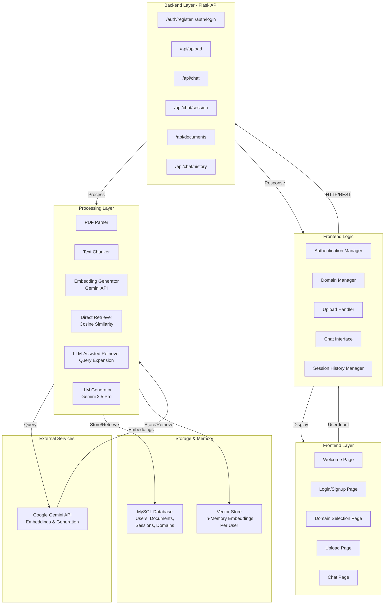
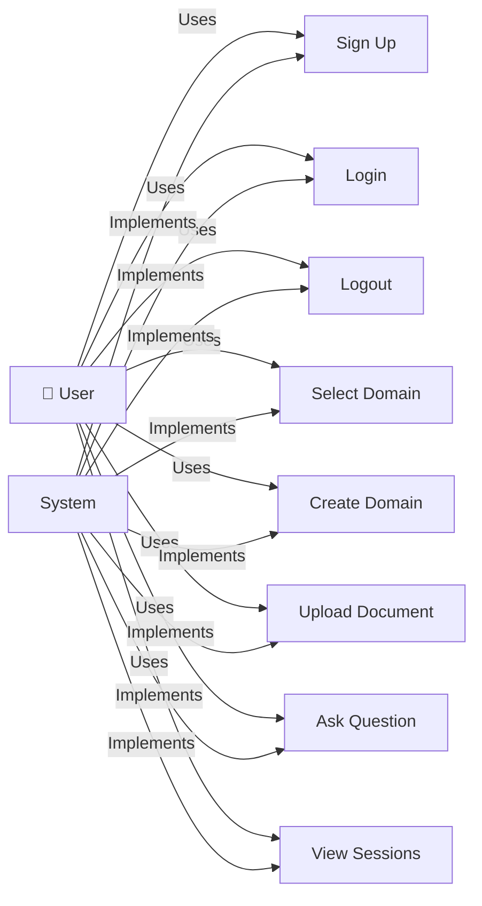
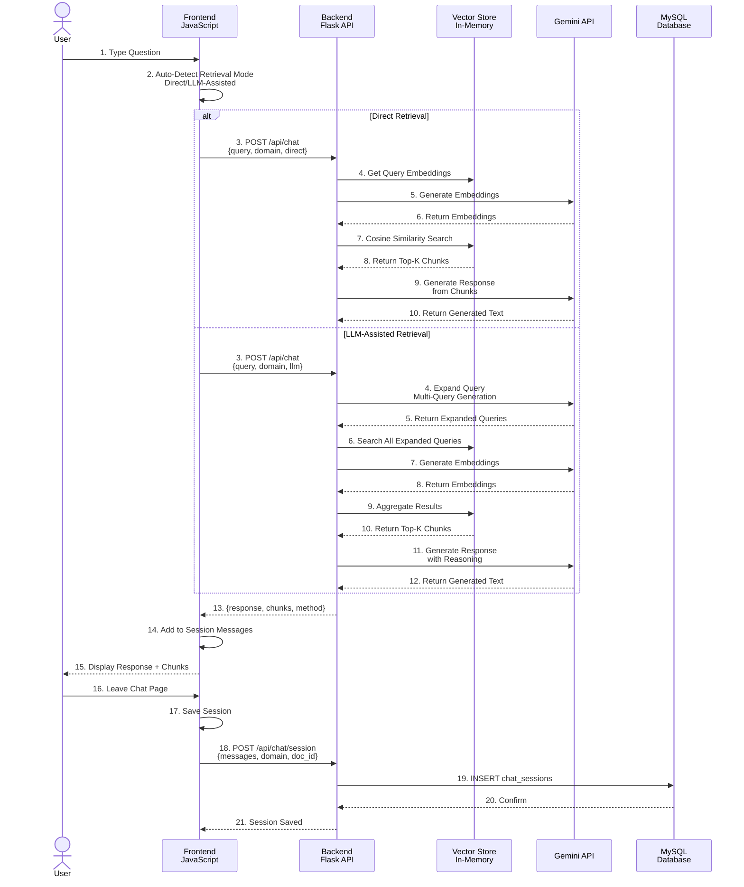
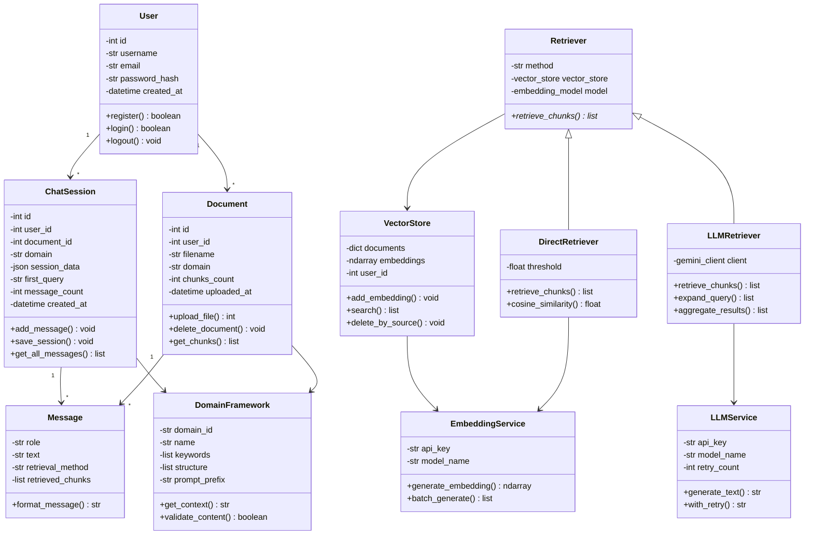
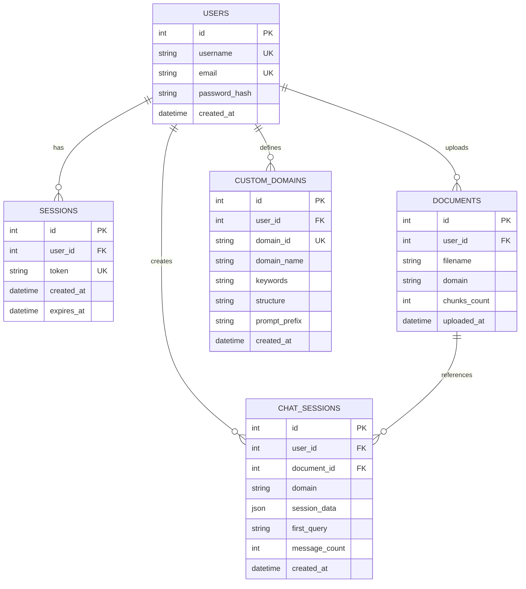
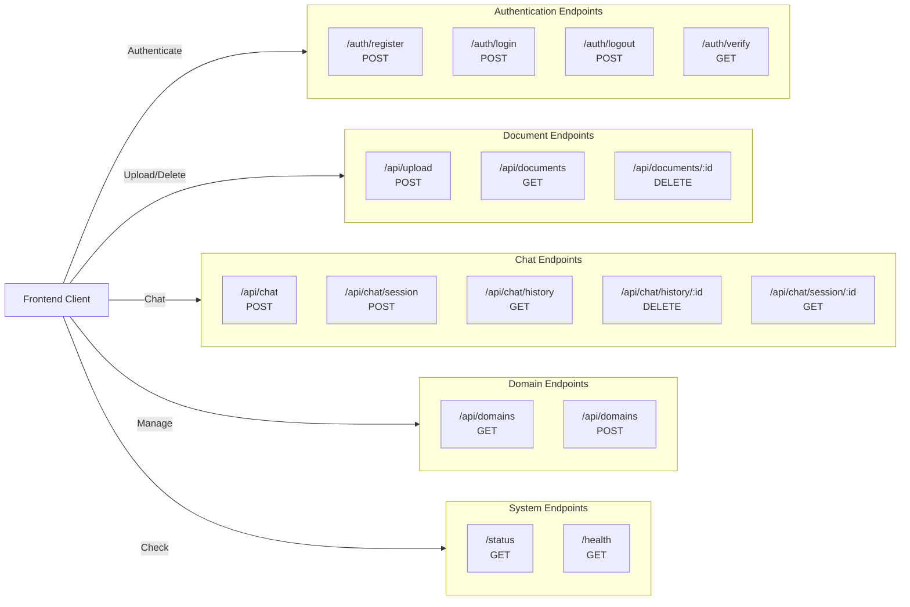

# Multi-Domain RAG System - Architecture Diagrams

## 1. SYSTEM ARCHITECTURE DIAGRAM



---

## 2. USE CASE DIAGRAM



---

## 3. SEQUENCE DIAGRAM - Chat Flow



---

## 4. CLASS DIAGRAM



---
## 5. ACTIVITY DIAGRAM
graph TD
    %% Document Upload Flow
    StartUpload(["User Starts Upload"])
    Select["Select File<br/>PDF or TXT"]
    Upload["Submit File"]
    Validate{File Valid?}
    Invalid["Show Error"]
    ValidFile["Parse & Extract Text"]
    Chunk["Split into Chunks"]
    Embed["Generate Embeddings"]
    StoreDB["Store in DB & Vector Store"]
    SuccessUpload["Chunks Added, Enable Chat"]
    EndUpload(["Upload Complete"])

    %% Chat Session Flow
    StartChat(["User Opens Chat"])
    Init["Initialize Session"]
    AskQuestion["User Asks Question"]
    AutoDetect["Auto-Detect Retrieval Mode"]
    ModeSet["Set Mode: Direct/LLM"]
    SendChat["Send to Backend"]
    Generate["Generate Response"]
    Response["Return Response"]
    TrackSession["Track Session"]
    DisplayResult["Display Response"]
    Loop{Continue Chatting?}
    Leave["User Leaves Chat"]
    SaveSession["Save Session"]
    EndChat(["Session Saved"])

    %% Document Upload Connections
    StartUpload --> Select
    Select --> Upload
    Upload --> Validate
    Validate -->|No| Invalid
    Invalid --> StartUpload
    Validate -->|Yes| ValidFile
    ValidFile --> Chunk
    Chunk --> Embed
    Embed --> StoreDB
    StoreDB --> SuccessUpload
    SuccessUpload --> EndUpload

    %% Chat Session Connections
    EndUpload --> StartChat
    StartChat --> Init
    Init --> AskQuestion
    AskQuestion --> AutoDetect
    AutoDetect --> ModeSet
    ModeSet --> SendChat
    SendChat --> Generate
    Generate --> Response
    Response --> TrackSession
    TrackSession --> DisplayResult
    DisplayResult --> Loop
    Loop -->|Yes| AskQuestion
    Loop -->|No| Leave
    Leave --> SaveSession
    SaveSession --> EndChat
```

---

## 7. DATABASE SCHEMA DIAGRAM



---

## 8. API ENDPOINT ARCHITECTURE



---

## 9. DATA FLOW DIAGRAM - Direct Retrieval Path

```mermaid
---
config:
  layout: fixed
---
flowchart TB
    Query["User Query"] -- "1. Tokenize" --> Normalize["Normalize Query"]
    Normalize -- "2. Generate" --> Embed["Embedding<br>Gemini API"]
    Embed -- "3. ndarray" --> VStore["Vector Store<br>Query Vector"]
    VStore -- "4. Cosine<br>Similarity" --> Score["Score All<br>Documents"]
    Score -- "5. Top-K" --> Chunks["Retrieved Chunks"]
    Chunks -- "6. Format" --> Context["Build Context<br>String"]
    Context -- "7. Prompt" --> Prompt["Create LLM Prompt<br>+ System Message"]
    Prompt -- "8. Request" --> LLM["Gemini 2.5 Pro<br>Generate Text"]
    LLM -- "9. Response" --> Output["Generated Answer"]
    Output -- "10. Generate" --> Response["JSON Response"]
    Response -- "11. Display" --> User["User Interface"]

     Query:::fill:#f9f,stroke:#333,stroke-width:2px
     Normalize:::fill:#f9f,stroke:#333,stroke-width:2px
     Embed:::fill:#f9f,stroke:#333,stroke-width:2px
     VStore:::fill:#bbf,stroke:#333,stroke-width:2px
     Score:::fill:#bbf,stroke:#333,stroke-width:2px
     Chunks:::fill:#bbf,stroke:#333,stroke-width:2px
     Context:::fill:#f9f,stroke:#333,stroke-width:2px
     Prompt:::fill:#f9f,stroke:#333,stroke-width:2px
     LLM:::fill:#f9f,stroke:#333,stroke-width:2px
     Output:::fill:#f9f,stroke:#333,stroke-width:2px
     Response:::fill:#f9f,stroke:#333,stroke-width:2px
     User:::fill:#f9f,stroke:#333,stroke-width:2px
```



---

## 10. Data Flow Diagram - LLM-Assisted Retrieval Path

```mermaid
graph LR
    Query["User Query"]
    
    Query -->|1. Analyze| Detect["Detect Query<br/>Complexity"]
    Detect -->|2. If Complex| Expand["LLM Expands Query<br/>Multi-variant"]
    
    Expand -->|3. Generate| Embeddings["Generate Embeddings<br/>for Each"]
    Embeddings -->|4. ndarray| MultiSearch["Multiple Searches<br/>in Vector Store"]
    
    MultiSearch -->|5. Score| ScoreAll["Score All Results"]
    ScoreAll -->|6. Rank & Dedup| Aggregate["Aggregate<br/>Results"]
    
    Aggregate -->|7. Top-K| ChunksFinal["Final Chunk List"]
    ChunksFinal -->|8. Context| ContextFull["Rich Context<br/>+ Reasoning"]
    
    ContextFull -->|9. Enhanced<br/>Prompt| PromptLLM["LLM Prompt<br/>with Context"]
    PromptLLM -->|10. Request| LLMFULL["Gemini 2.5 Pro<br/>Generate with<br/>Reasoning"]
    
    LLMFULL -->|11. Response| OutputFull["Comprehensive<br/>Answer"]
    OutputFull -->|12. Return| FinalResponse["JSON Response"]
    FinalResponse -->|13. Display| UserFinal["User Interface"]
```



---

## System Features Summary

### Core Capabilities
1. **Multi-Domain Support**: Healthcare, Legal, Finance, Technical, General + Custom Domains
2. **Document Processing**: PDF/TXT extraction with automatic chunking
3. **Vector Embeddings**: Gemini Embedding API for semantic search
4. **Dual Retrieval Modes**:
   - Direct: Fast cosine similarity search
   - LLM-Assisted: Query expansion + multi-variant search
5. **Auto-Detection**: Intelligently selects retrieval mode based on query complexity
6. **Session Management**: Complete chat sessions saved with all Q&A pairs
7. **User Authentication**: Bcrypt password hashing + session tokens
8. **Document Management**: Upload, view, delete uploaded documents
9. **Chat History**: Resume previous conversations, view all sessions

### Error Handling
- LLM fallback: Direct retrieval works even if Gemini API fails
- Retry logic: Automatic retries for network failures
- Graceful degradation: Raw chunks returned if generation fails

### Performance Features
- In-memory vector store per user
- Cosine similarity with configurable threshold
- Efficient chunking strategy
- Multi-query expansion for complex questions
- Deduplication of retrieved results
